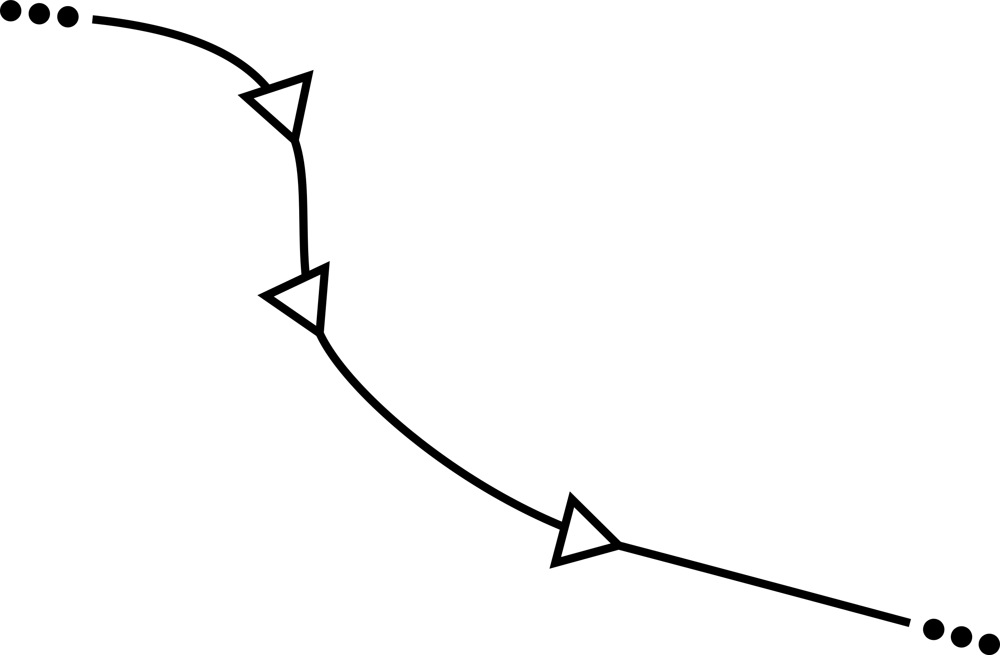

#  vizflow

[vizflow.js](https://github.com/vizflow/vizflow) - a render-loop library written using EcmaScript.6 (ES6) with no other external dependencies. Vizflow is a light-weight library for adding transition effects and interactive visualizations to HTML5 documents with a simpler design compared to other popular interactive visualization libraries like [D3js](http://d3js.org). 

Instead of focusing on specific applications such as data visualization, it only provides an engine for running animations, transition effects, simulations, games, etc., depending on the application. 

Vizflow uses the symbol `$Z` (read as "bling Z" or "dollar Z") for defining its namespace.

This is a work in progress. Keeping the library simple-to-use, small, and efficient in terms of performance are the main goals of this project. Feedback wanted.

<!---
  
For example, when using `d3` we might want to visualize one dataset representing intervals  as lines and another representing points as circles, and then have them both fade-in. 

Using `d3`, this would normally lead to code snippets like:

```javascript
d3.selectAll('.blue_circle')
  .data(myData1)
  .enter()
  .append('circle')
  .attr('class', 'blue_circle')
  .style('opacity', 0)
  .attr('cx', function (d) { d.x })
  .attr('cy', function (d) { d.y })
  .attr('r', function (d) { d.r })
  .transition()
  .duration(1000)
  .ease('linear')
  .style('opacity', 1);

d3.selectAll('.red_circle')
  .data(myData2)
  .enter()
  .append('class', 'red_circle')
  .append('path')
  .style('opacity', 0)
  .attr('d', function (d) { d3.svg.line(d) })
  .transition()
  .duration(1000)
  .ease('linear')
  .style('opacity', 1);
```

which works, but has some repeated code arising from both the chaining syntax for defining transitions and also the presence of slight variations in the processing (e.g. lines vs. circles).

--> 

# Example

The file `index.html` included in this repository contains a demo showing an interactive stochastic dynamics simulation with three particles in a rectangular domain rendered as colored circles using either Canvas or SVG. 

Clicking on a circle will randomly change its 2D `(x, y)` position and radius by sampling from am appropriate uniform distributions for each of these variables.

Modify the `index.html` file to create your own interactive visualizations, simulations, and games with maximal flexibility and minimal overhead.

Load the `index.html` file locally to test the code in a development environment (requires a local web server such as [live-server](https://github.com/tapio/live-server) to be running). 

The "examples" subdirectory contains other examples. 
The pH visualization/game example is described [here](https://www.linkedin.com/pulse/ph-visualization-i-daniel-korenblum) and the Election Fighter example is described [here](https://www.linkedin.com/pulse/vizflow-testing-via-games-part-i-election-fighter-daniel-korenblum).

The compiled examples can also be loaded without a local server by going to the `index.html` files within the subdirectories contained in `examples`.

Compile `build.js` using `jspm bundle-sfx --minify src/vizflow` for running in a production environment.
This [github preview page](http://htmlpreview.github.io/?https://github.com/dannyko/vizflow/blob/master/examples/three_circles_canvas/index.html) has a demo showing the compiled version using Canvas rending.

# References

* [ES6](http://wiki.ecmascript.org/doku.php?id=harmony:specification_drafts)
* [Promise](https://developer.mozilla.org/en-US/docs/Mozilla/JavaScript_code_modules/Promise.jsm/Promise)
* [Babel](http://babeljs.io/)
* [JSPM](https://github.com/jspm/jspm-cli)
* [ES6+jspm template](https://github.com/geelen/loopgifs)
* [2D Picking in Canvas](https://bocoup.com/weblog/2d-picking-in-canvas/)
