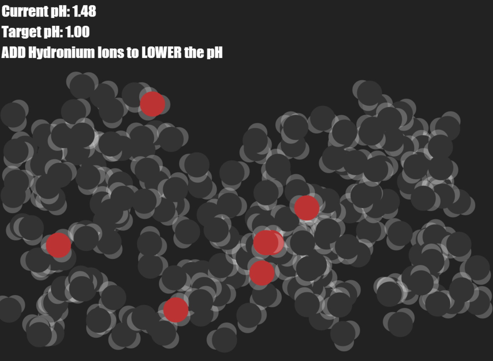

#  pH Game

This "pH Game" is an interactive visualization example buit using the `vizflow` ES6 animation engine.

[vizflow.js](https://github.com/dannyko/vizflow.js) - an application-agnostic interactive visualization engine written using EcmaScript.6 (ES6) with no other external dependencies. 

The file `index.html` included in this repository contains a demo showing an interactive visualization of 220 molecules of either neutral water (H2O) or positively-charged hydronium ions (H3O+).

Clicking on a molecule will toggle its stage between water and hydronium.

Depending on the randomized target pH given at the start of the game, add or remove hydronium ions in order to lower or raise the respective pH.

The purpose of this game is to teach the player to visualize that adding hydronium ions reduces the pH while removing hydronium ions raises the pH.

Atomic radii, bond-lengths, and bond-angles are drawn to scale. No collision detection or force-fields are used and the position and orientation dynamics are sampled from uniform random distributions.

Here is the link to the [live preview](http://htmlpreview.github.io/?https://github.com/dannyko/vizflow/blob/master/examples/ph_game/index.html) page. 